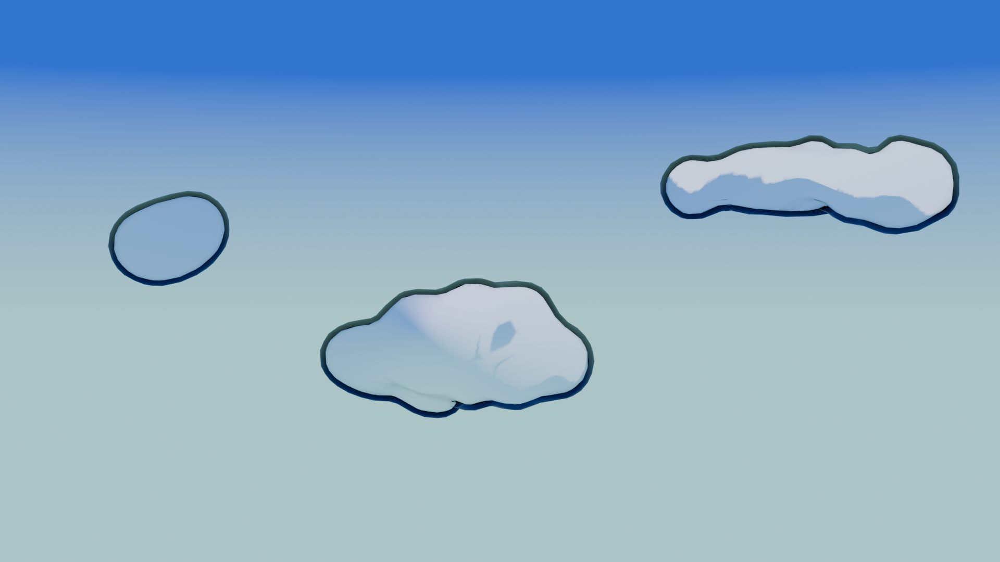
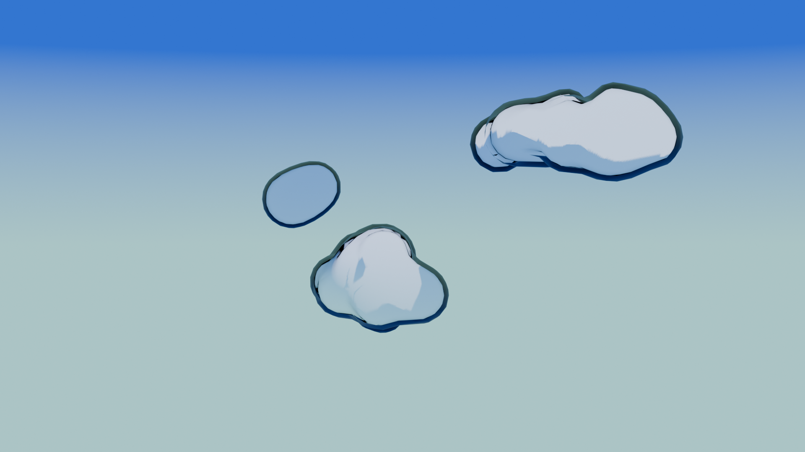
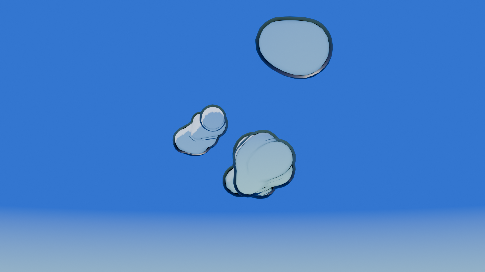

### Clouds

### Design
I wanted the clouds to be fluffy and easily recognisable as clouds. I also aimed for a blocky texture and a soft round appearance

### Methodology
My cloud methodology is largely based around the first part of this [tutorial](https://www.youtube.com/watch?v=sWtrenoC9eA) by [@Comfee Mug](https://www.youtube.com/@ComfeeMug) on YouTube, during which they also attributed [@tawansunflower](https://www.youtube.com/@tawansunflower) for assisting with the tutorial.

I only employed the techniques from the first ~4 minutes of the tutorial to achieve my desired effect.

I employed a material with a similar effect to my rocks, though this time with softer edges to the shadows

### Renders

  

  

### References

- Comfee Mug (2024) *How to Make 3D Painterly Anime Clouds in Blender - Comfee Tutorial*. Available at: [https://www.youtube.com/watch?v=sWtrenoC9eA](https://www.youtube.com/watch?v=sWtrenoC9eA)

- Levi Magony  (2023) *10 Outline Techniques I Wish I Knew Sooner in Blender* Available at: [https://youtu.be/cnQu1kMs49s?si=QAtjT0u9CFJxJgqp](https://youtu.be/cnQu1kMs49s?si=QAtjT0u9CFJxJgqp)

### Additional Notes
clouds made following the first part of this tutorial:
https://www.youtube.com/watch?v=sWtrenoC9eA

NOTE: Do not follow rest of tutorial, it is based on a pre blender 4.0 version

1. Clouds are made using Metaballs that attach together to form large blobs (roughly in the shape of clouds)
2. Next convert the meta balls to a single mesh(CTRL + A, Visual geometry to mesh)
3. Add a Subdivide and then a decismate modifier (to keep the number of verticies down)
4. Finnaly create a basic toon shader and apply to the mesh

- Reminder to add cloud from ff somewhere in there

