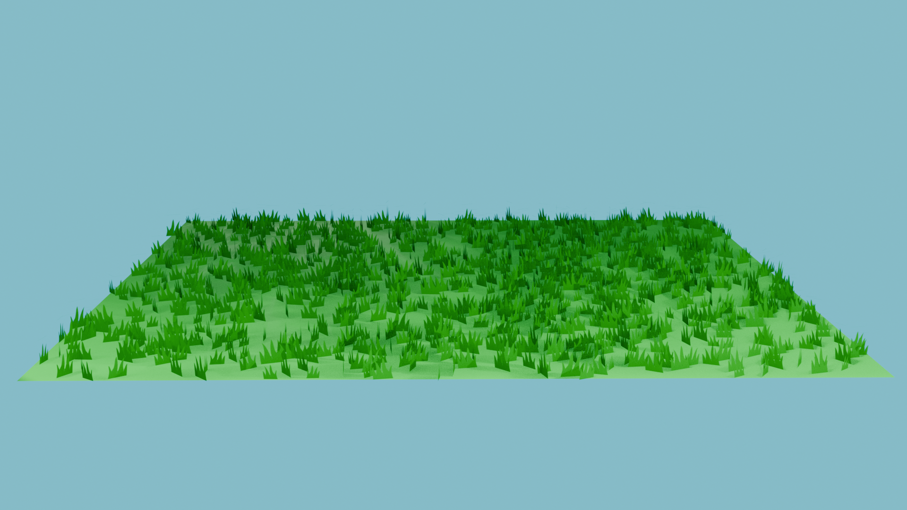
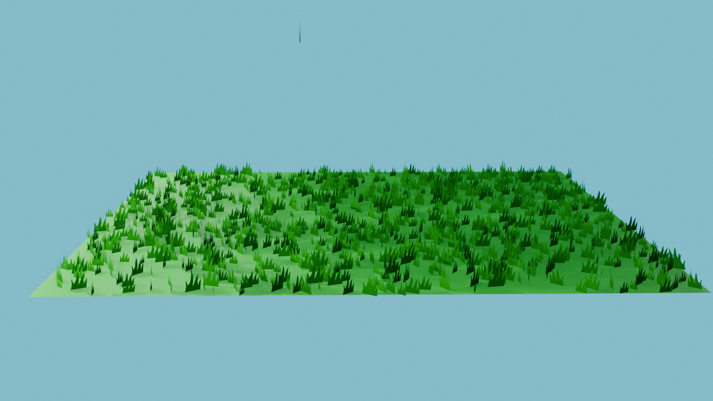
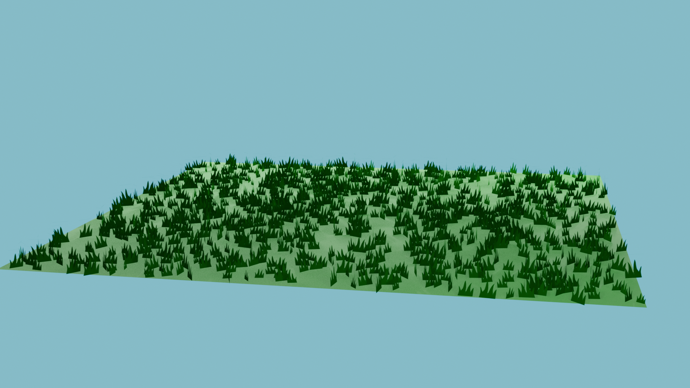

# Grass object

### Design
I wanted to make very simple grass model with very few polygons. The idea was that you could spawn many grass models onto a single plane using the array modifier or the equivalent in unreal engine

### Methodology
The methodology is based around the basic premise used by LODs. I use a flat plane with a texture that uses a transparent background. This way by overlaying many different grass objects you can get a fairly accurate effect from afar.

### Renders

  

  

### References:

- Ahmad Merheb (August, 2024) *How to Make Grass in Blender*. Accessible at: https://ahmadmerheb.com/blender-grass/